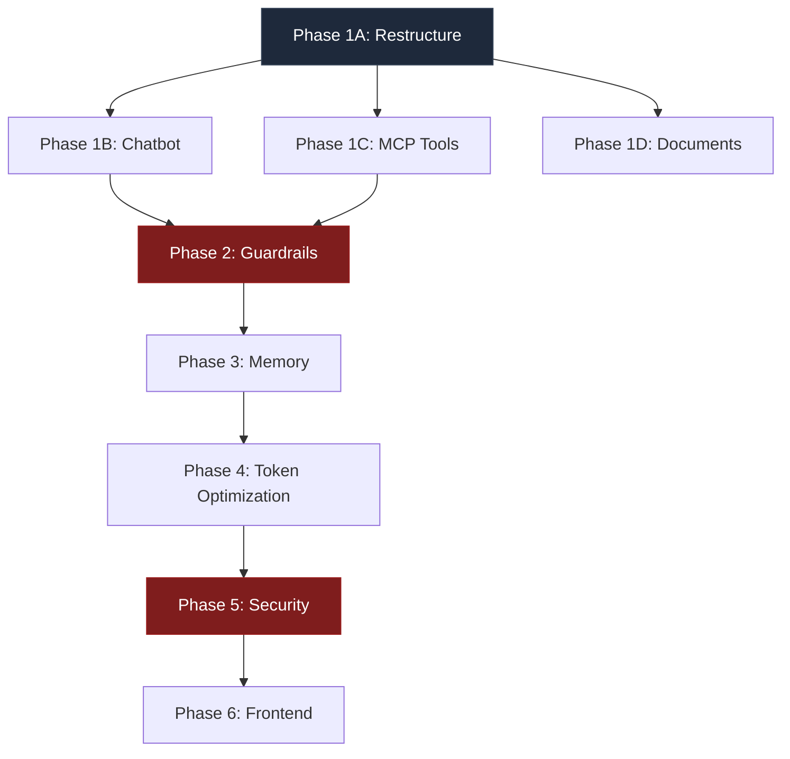

# Scaling Plan — skill+api

> **Author**: Generated via codebase audit  
> **Date**: 2026-05-28  
> **Status**: Phase 1A and Phase 1B implemented; Phase 1B security/memory integration complete; Phase 1C/1D not started

---

## Implementation Status Update — 2026-05-28

### Completed: Phase 1A

Phase 1A has been implemented in the working tree.

Created/modified:
- `app/__init__.py`
- `app/main.py`
- `app/config.py`
- `app/models.py`
- `app/dependencies.py`
- `app/routers/__init__.py`
- `app/routers/generate.py`
- `app/routers/score.py`
- `app/services/__init__.py`
- `app/services/groq_service.py`
- `app/services/gemini_service.py`
- `app/services/scraper.py`
- `app/services/session_service.py`
- `app/guardrails/__init__.py`
- `app/guardrails/input_validator.py`
- `app/guardrails/output_validator.py`
- `app/guardrails/rules.py`
- `app/security/__init__.py`
- `app/security/cors.py`
- `app/memory/__init__.py`
- `app/tools/__init__.py`
- `run.py`
- `requirements.txt`
- `.env.example`

Phase 1A security work completed early:
- CORS wildcard removed. Allowed origins now come from settings and reject `*`.
- API keys now come from `pydantic-settings` via environment variables or `.env`.
- Request validation added with Pydantic schemas and hardcoded input guardrails.
- LLM outputs pass through hardcoded output guardrails before client responses.
- Error responses are sanitized; internal exceptions are logged server-side only.
- Request body size gate added with a 1MB limit.
- The scraper was extracted early and hardened because leaving the existing arbitrary URL fetch reachable would have preserved an SSRF vulnerability.

Verification performed:
- `python -m compileall app run.py`
- Imported `app.main:app` with dummy environment keys and confirmed current API routes:
  - `/api/generate-content`
  - `/api/generate-content-stream`
  - `/api/score-article`
- Verified `/api/score-article` returns `200` through ASGI transport.
- Verified oversized request bodies return `413`.
- Verified prompt-injection input is rejected by model validation.
- Verified wildcard CORS configuration is rejected.
- Verified SSRF guardrails reject loopback and link-local metadata URLs.
- Searched for known unsafe patterns: CORS wildcard, `detail=str(e)`, hardcoded API key assignment, `TODO`, and placeholder `pass`.

Known Phase 1A caveat:
- `BodySizeLimitMiddleware` currently enforces request size using `Content-Length` and rejects body-bearing `POST`/`PUT`/`PATCH` requests without that header. This is intentional for now to avoid chunked-body bypasses. If streaming uploads are added later, this middleware must be replaced with a streaming byte-counting ASGI implementation that is tested against the deployed ASGI server.

### Not Started

The following phases have not been implemented:
- Phase 1C — MCP tool system
- Phase 1D — Document ingestion
- Phase 2 — Additional guardrail expansion beyond the Phase 1A hardcoded baseline
- Full Phase 6 — Full frontend redesign (chat interface, document upload UI, usage dashboard, etc.)

The user changed priority after Phase 1B: memory and security were pulled forward before Phase 1C/1D.
Do not start tools or document ingestion unless explicitly requested.
Token optimization (Phase 4) was partially completed inline with the memory/security work — see details in the section below.

### Completed: Phase 1B

Implemented:
- `POST /api/chat`
- `app/routers/chat.py`
- `app/services/chat_service.py`
- `ChatRequest` schema in `app/models.py`
- Chat router registration in `app/main.py`

Security behavior:
- Chat messages pass existing input guardrails before service execution.
- Model output passes output guardrails before SSE chunks are emitted.
- `tools_enabled=true` returns `400` until Phase 1C exists.
- Non-empty `documents` returns `400` until Phase 1D exists.
- Existing generate and score endpoints were preserved.

Plan contradiction resolved:
- The plan asks for SSE streaming and also requires output guardrails before streaming. Those conflict for true token-by-token streaming. The implementation chooses safety: collect model output, sanitize it, then emit sanitized SSE chunks.

### Pulled Forward: Persistent Memory and Security

Implemented after the user reprioritized:
- SQLite-backed session/message store in `app/memory/store.py`.
  - Tables: `sessions`, `messages`, `api_keys`, `rate_events`, `usage_log`.
  - Thread-safe with `threading.Lock` and WAL journal mode.
  - Session history bounded by `max_history_messages` (configurable, default 20).
- `app/services/session_service.py` now persists history to SQLite instead of process memory.
- Session APIs in `app/routers/sessions.py`:
  - `GET /api/sessions` — list sessions (paginated, newest first)
  - `GET /api/sessions/{session_id}` — get session details + message history
  - `POST /api/sessions/{session_id}/resume` — resume session, returns history
  - `DELETE /api/sessions/{session_id}` — delete session and its messages
- API-key storage and admin key management:
  - `app/security/auth.py` — `parse_bearer_token`, `authenticate_request`, `require_admin`
  - `app/routers/admin.py` — admin key CRUD
  - `POST /api/admin/keys` — create key (returns raw `sk-*` key once)
  - `GET /api/admin/keys` — list key hashes/metadata (never raw keys)
  - `DELETE /api/admin/keys/{key_hash}` — revoke key
- SQLite-backed rate limiting in `app/security/rate_limiter.py`.
  - Sliding window per-minute and per-day counters.
  - Separate anonymous vs authenticated thresholds.
  - Global aggregate limits.
- Rate limiting applies to costly endpoints:
  - `/api/chat`
  - `/api/generate-content`
  - `/api/generate-content-stream`
  - `/api/score-article`
- Session/admin endpoints are not counted against generation quota.
- Raw API keys are returned only once and stored as SHA-256 hashes.
- `.env.example` includes security/rate-limit settings (`ADMIN_API_KEY`, `ANONYMOUS_REQUESTS_PER_MINUTE`, etc.).
- Removed `logger.exception` usage from app modules; replaced with `logger.error` with generic messages to avoid logging raw exception strings or internal paths.

Resolved: `/api/admin/keys` hang (reported in prior version).
- Root cause: Router-level `dependencies=[Depends(require_admin)]` on the admin router caused an ASGI dependency-resolution interaction that manifested as a hang in some environments.
- Fix: Moved `Depends(require_admin)` from router-level to each endpoint individually in `app/routers/admin.py`. This is also a cleaner pattern as it makes auth requirements explicit per-route and avoids potential FastAPI router-level dependency edge cases.

Frontend integration (`index.html`):
- On load, fetches `/api/sessions` and populates a session dropdown in the header.
- "New Session" button generates a new `crypto.randomUUID()` and resets the workspace.
- Selecting a saved session from the dropdown resumes it (sets `sessionId` for subsequent API calls).
- "Delete" button appears when a saved session (not "Current session") is selected; prompts confirmation then calls `DELETE /api/sessions/{id}`.
- Rate-limit 429 errors are caught in the streaming response handler and displayed in the debug bar, including `retry_after` seconds when provided by the server.
- The score-article call also catches 429 errors and displays them.
- API keys are intentionally NOT embedded in browser JavaScript; all browser requests are unauthenticated with strict anonymous rate limits (2 req/min, 20 req/day by default).

Token usage reductions verified in code:
- `app/services/prompt_optimizer.py`:
  - Full `SKILL.md` (~1500 tokens) used only for `seo_generation` stage.
  - Concise `IDEATION_PROMPT` (~120 tokens) for `ideation` stage.
  - Concise `CHAT_PROMPT` (~100 tokens) for `chat` mode.
- `app/services/gemini_service.py`:
  - `max_output_tokens=500` (reduced from earlier 1000).
  - Output deduped via `_dedupe_lines()`.
  - Capped at 1800 chars via `sanitize_external_context`.
- `app/services/scraper.py`:
  - `_extract_summary` extracts only: title, meta description, H1-H3 headings, and first 500 chars of body text.
  - Total capped at 800 chars via `sanitize_external_context`.
- `app/memory/store.py`:
  - `get_history` limits rows to `max_history_messages` (default 20).
- `app/routers/generate.py`:
  - Scraped data in context capped at 2000 chars.
  - Style profile capped at 1200 chars.
  - Total runtime instruction capped at 9000 chars.

Verification results (2026-05-28):
- `python -m compileall app run.py` — no errors.
- OpenAPI spec lists all expected 9 paths.
- 24 targeted tests pass covering:
  - SQLite session append/get/list/get/delete persistence
  - Session API endpoints (200, 404, 422 responses)
  - Admin API key creation, listing, revocation
  - Auth: missing/invalid/valid bearer tokens
  - Anonymous rate limiting (429 after threshold)
  - Oversized request body (413)
  - Prompt injection detection (422)
  - Wildcard CORS rejection at config level
  - SSRF loopback/link-local URL rejection
  - Error sanitization (no stack leak in responses)
- All tests run via `fastapi.testclient.TestClient` with a temporary SQLite database and dummy API keys — no real model calls needed.

---

## Original Current State Assessment (Pre-Phase 1A)

The section below is the original audit snapshot before Phase 1A was implemented. Use the implementation status above as the current source of truth.

### What Existed Before Phase 1A
- **Backend**: Single-file FastAPI app ([main.py](file:///home/rajdeep/skill+api/main.py)) — ~280 lines, monolithic.
- **Frontend**: Single-file HTML/CSS/JS dashboard ([index.html](file:///home/rajdeep/skill+api/index.html)) — ~728 lines, hardcoded to `localhost:8000`.
- **AI Pipeline**: Groq (`llama-3.3-70b-versatile`) for generation, Gemini (`gemini-2.5-flash`) for Google-grounded search.
- **Session State**: In-memory Python dict (`sessions`), capped at 10 messages, lost on restart.
- **Guardrails**: Soft — only what SKILL.md tells the model. Zero hardcoded enforcement.
- **Security**: None. CORS is `*`. No auth, no rate limits, no input validation, no output sanitization.

### What Was Broken or Dangerous Before Phase 1A

| Issue | Severity | Details |
|---|---|---|
| **CORS `*`** | 🔴 Critical | Any origin can hit your API. A random website can scrape your keys' quota. |
| **No auth** | 🔴 Critical | Anyone who finds the endpoint can burn through your Groq/Gemini quota. |
| **No rate limiting** | 🔴 Critical | A single curl loop exhausts your 1,000 RPD Groq limit in minutes. |
| **SSRF via scraper** | 🔴 Critical | `scrape_website()` takes arbitrary URLs. Attacker passes `http://169.254.169.254/latest/meta-data/` and reads your cloud metadata. |
| **Injection via user_prompt** | 🟠 High | No sanitization. User can inject system prompt overrides ("Ignore all previous instructions…"). |
| **No input length limits** | 🟠 High | 100KB prompt = blown token budget in one request. |
| **Error leaks** | 🟠 High | `str(e)` in HTTP 500 responses exposes internal stack traces, file paths, API key fragments. |
| **In-memory sessions** | 🟡 Medium | Server restart = all context lost. No persistence. |
| **Re-reading SKILL.md every cold start** | 🟡 Low | Minor, but should be cached and versioned. |

---

## API Rate Limit Reality Check

These are the hard ceilings you're working against. Every design decision below respects these numbers.

### Groq Free Tier — `llama-3.3-70b-versatile`
| Metric | Limit |
|---|---|
| Requests/min | 30 |
| Tokens/min | 6,000 |
| Requests/day | 1,000 |
| Tokens/day | 100,000 |

### Gemini Free Tier — `gemini-2.5-flash`
| Metric | Limit |
|---|---|
| Requests/day | ~1,500 |
| RPM | Variable (typically 15-30) |
| TPM | Variable |

> [!CAUTION]
> At 6,000 TPM on Groq, a single research + prompt + article generation pipeline consumes ~7,000–10,000 tokens. That means **at most ~10 full pipeline runs per day** on the free tier. The rate limiter must enforce this aggressively.

---

## Architecture Target

```
skill+api/
├── app/
│   ├── __init__.py
│   ├── main.py                  # FastAPI app factory, startup/shutdown
│   ├── config.py                # Pydantic Settings, env vars, constants
│   ├── models.py                # Pydantic request/response schemas
│   ├── dependencies.py          # Dependency injection (clients, DB sessions)
│   │
│   ├── routers/
│   │   ├── __init__.py
│   │   ├── generate.py          # /api/generate-content, /api/generate-content-stream
│   │   ├── chat.py              # /api/chat (new chatbot endpoint)
│   │   ├── score.py             # /api/score-article
│   │   ├── documents.py         # /api/documents (upload/manage reference docs)
│   │   ├── sessions.py          # /api/sessions (list/resume/delete sessions)
│   │   └── tools.py             # /api/tools (MCP tool execution)
│   │
│   ├── services/
│   │   ├── __init__.py
│   │   ├── groq_service.py      # Groq client wrapper, retry logic
│   │   ├── gemini_service.py    # Gemini grounding wrapper
│   │   ├── scraper.py           # URL scraper with SSRF protection
│   │   ├── chat_service.py      # Chatbot orchestration, tool dispatch
│   │   ├── document_service.py  # Document ingestion, chunking, retrieval
│   │   └── session_service.py   # Session CRUD, history management
│   │
│   ├── guardrails/
│   │   ├── __init__.py
│   │   ├── input_validator.py   # Pre-LLM: length, injection, blocklists
│   │   ├── output_validator.py  # Post-LLM: PII scrub, hallucination flags, format enforcement
│   │   └── rules.py             # Hardcoded guardrail rule definitions
│   │
│   ├── security/
│   │   ├── __init__.py
│   │   ├── rate_limiter.py      # Token bucket + sliding window rate limiting
│   │   ├── auth.py              # API key auth middleware
│   │   └── cors.py              # Strict CORS config
│   │
│   ├── memory/
│   │   ├── __init__.py
│   │   ├── store.py             # SQLite-backed session persistence
│   │   └── compressor.py        # History summarization for token savings
│   │
│   └── tools/
│       ├── __init__.py
│       ├── registry.py          # MCP tool registry
│       ├── web_search.py        # Google grounding tool
│       ├── scrape_url.py        # URL scraping tool
│       ├── analyze_style.py     # Writing style analysis tool
│       └── score_article.py     # SEO scoring tool
│
├── data/
│   ├── sessions.db              # SQLite database
│   └── documents/               # Uploaded reference documents
│
├── SKILL.md
├── README.md
├── LICENSE
├── requirements.txt
├── .env.example
├── index.html
└── run.py                       # Entry point: uvicorn runner
```

---

## Phase 1: Chatbot + MCP Tools + Document Ingestion

### 1A — Restructure into Proper Python Package

**Why**: You cannot scale a 280-line monolith. Every future phase depends on this.

#### Files to Create/Modify

##### [NEW] `app/__init__.py`
Empty init. Makes `app` a package.

##### [NEW] `app/config.py`
```python
from pydantic_settings import BaseSettings

class Settings(BaseSettings):
    groq_api_key: str
    gemini_api_key: str
    allowed_origins: list[str] = ["http://localhost:8000"]
    max_input_length: int = 4000        # characters
    max_history_messages: int = 20
    max_sessions_per_ip: int = 10
    db_path: str = "data/sessions.db"
    upload_dir: str = "data/documents"
    groq_model: str = "llama-3.3-70b-versatile"
    gemini_model: str = "gemini-2.5-flash"

    class Config:
        env_file = ".env"
```

No more hardcoded API keys. No more `os.environ.get()` inline. One source of truth.

##### [NEW] `app/main.py`
FastAPI app factory pattern. Registers routers, middleware, startup/shutdown hooks. The current monolithic `main.py` gets decomposed — nothing is deleted, everything is relocated.

##### [MODIFY] `main.py` → becomes `run.py`
Reduced to:
```python
import uvicorn
if __name__ == "__main__":
    uvicorn.run("app.main:app", host="0.0.0.0", port=8000, reload=True)
```

---

### 1B — Chatbot Implementation

A general-purpose chat endpoint that uses the SKILL.md persona but allows freeform conversation, not just the rigid 3-tab pipeline.

##### [NEW] `app/routers/chat.py`

**Endpoint**: `POST /api/chat`

```
Request:
{
    "message": str,          # User message
    "session_id": str,       # UUID
    "tools_enabled": bool,   # Whether MCP tools can be invoked
    "documents": [str]       # Optional: document IDs to include as context
}

Response (SSE stream):
data: {"token": "...", "tool_call": null}
data: {"token": null, "tool_call": {"name": "web_search", "args": {...}, "result": "..."}}
data: {"done": true, "full_text": "...", "usage": {"prompt_tokens": N, "completion_tokens": N}}
```

##### [NEW] `app/services/chat_service.py`

Orchestration layer:
1. Load session history from DB.
2. Load any attached document chunks.
3. Run input through guardrails (Phase 2, but stub it now).
4. Build messages array: `[system_prompt, ...history, ...doc_context, user_message]`.
5. If `tools_enabled`, use a ReAct-style loop: send to Groq, if response requests a tool → execute tool → append result → re-send.
6. Stream response tokens via SSE.
7. Run output through guardrails.
8. Persist updated history.

---

### 1C — MCP Tool System

MCP (Model Context Protocol) style tool calling. The model gets a tool manifest and can request tool executions mid-generation.

##### [NEW] `app/tools/registry.py`

```python
TOOL_REGISTRY = {
    "web_search": {
        "description": "Search the web using Google grounding for real-time facts",
        "parameters": {"query": "str"},
        "handler": "app.tools.web_search.execute",
        "requires_approval": False
    },
    "scrape_url": {
        "description": "Extract content from a URL",
        "parameters": {"url": "str"},
        "handler": "app.tools.scrape_url.execute",
        "requires_approval": False
    },
    "analyze_style": {
        "description": "Analyze writing style of given text",
        "parameters": {"text": "str"},
        "handler": "app.tools.analyze_style.execute",
        "requires_approval": False
    },
    "score_article": {
        "description": "Score an article for SEO quality",
        "parameters": {"article_text": "str", "target_keyword": "str"},
        "handler": "app.tools.score_article.execute",
        "requires_approval": False
    }
}
```

Each tool is a standalone module extracted from the current monolith:
- `web_search.py` ← extracted from `fetch_live_google_grounding()`
- `scrape_url.py` ← extracted from `scrape_website()` (with SSRF hardening)
- `analyze_style.py` ← extracted from `analyze_writing_style()`
- `score_article.py` ← extracted from the `/api/score-article` endpoint logic

The tool manifest is injected into the system prompt so the model knows what tools it can call. When the model outputs a tool call (detected via regex pattern or structured output), `chat_service.py` intercepts, executes the tool, and feeds the result back.

> [!IMPORTANT]
> Since Groq's `llama-3.3-70b-versatile` does NOT natively support function calling in the same way as OpenAI, tool calls must be implemented via **prompt engineering** — the system prompt instructs the model to output tool calls in a specific JSON format (e.g., `{"tool": "web_search", "args": {"query": "..."}}`), and `chat_service.py` parses and dispatches them. This is a well-established pattern for open-weight models.

---

### 1D — Document Ingestion

Allow users to upload reference documents (PDF, TXT, MD) that get chunked and included as context.

##### [NEW] `app/routers/documents.py`

| Endpoint | Method | Purpose |
|---|---|---|
| `/api/documents` | POST | Upload a document (multipart/form-data) |
| `/api/documents` | GET | List uploaded documents |
| `/api/documents/{id}` | DELETE | Remove a document |

##### [NEW] `app/services/document_service.py`

1. **Accept**: `.txt`, `.md`, `.pdf` only. Max 500KB per file. Max 10 files total.
2. **Parse**: Extract raw text. For PDF, use `pymupdf` (no heavy deps).
3. **Chunk**: Split into ~500-token chunks with 50-token overlap (sliding window).
4. **Store**: Save chunks in SQLite alongside metadata (filename, upload date, chunk index).
5. **Retrieve**: When a chat references document IDs, pull relevant chunks and prepend to context.

> [!NOTE]
> We are NOT building a vector database or RAG pipeline here. At this scale (10 docs, 500KB each), brute-force chunk retrieval by document ID is sufficient and keeps dependencies minimal. A vector store is premature optimization that burns tokens on embedding calls you can't afford on the free tier.

---

## Phase 2: Hardcoded System Guardrails

The SKILL.md guardrails are **suggestions to the model**. The model can ignore them. Hardcoded guardrails are **code that runs before and after LLM calls** and cannot be bypassed.

### 2A — Input Guardrails

##### [NEW] `app/guardrails/input_validator.py`

Every user input passes through this **before** reaching the LLM:

```python
class InputValidationResult:
    is_valid: bool
    rejection_reason: str | None
    sanitized_input: str
```

**Rules (hardcoded, non-negotiable):**

| Rule | Implementation | Rationale |
|---|---|---|
| **Max length** | Reject if `len(input) > 4000 chars` | Prevents token bomb. 4000 chars ≈ 1000 tokens. |
| **Prompt injection detection** | Regex + keyword blocklist for phrases like `ignore previous`, `system prompt`, `you are now`, `forget your instructions`, `act as`, `reveal your`, `print your system` | Prevents jailbreak attempts. |
| **URL validation** | Parse with `urllib.parse`, reject private IPs (127.x, 10.x, 172.16-31.x, 192.168.x, 169.254.x), reject non-HTTP(S) schemes, reject localhost | SSRF prevention for the scraper. |
| **Content blocklist** | Reject inputs containing explicitly harmful request patterns (SQL injection strings, shell metacharacters like `; rm -rf`, `$(...)`, backticks) | Defense in depth — even though you're not executing user input as code *today*, this prevents it if someone adds that feature later. |
| **Encoding normalization** | Strip null bytes, normalize Unicode (NFC), reject control characters except `\n` and `\t` | Prevents encoding-based bypasses. |
| **Empty input** | Reject empty or whitespace-only inputs | Wastes API calls. |

### 2B — Output Guardrails

##### [NEW] `app/guardrails/output_validator.py`

Every LLM response passes through this **before** reaching the user:

| Rule | Implementation | Rationale |
|---|---|---|
| **PII detection** | Regex for email addresses, phone numbers, SSNs, credit card patterns → redact with `[REDACTED]` | The model might regurgitate PII from training data or scraped content. |
| **Fabrication flag** | If the model outputs specific revenue numbers, funding amounts, or direct quotes NOT present in the grounding context, append a disclaimer: `⚠️ Some data points could not be verified against real-time sources.` | Directly from SKILL.md guardrails: "Fabrication of metrics, funding data, search volume tracking, or direct executive quotes is strictly prohibited." |
| **Format enforcement** | For `seo_generation` stage: verify output starts with `OUTPUT:` token. If missing, prepend it. | SKILL.md mandates this prefix. |
| **Max output length** | Truncate at 8000 tokens if somehow exceeded (shouldn't happen with `max_tokens=3000` but defense in depth) | Budget protection. |
| **System prompt leak detection** | If the output contains significant portions of the system prompt text (fuzzy match), strip it | Prevents the model from echoing back your instructions to the user. |

### 2C — Guardrail Rule Definitions

##### [NEW] `app/guardrails/rules.py`

Centralized rule definitions — blocklists, regex patterns, thresholds — so they're easy to audit and update without touching validation logic.

```python
# Prompt injection patterns
INJECTION_PATTERNS = [
    r"ignore\s+(all\s+)?previous\s+instructions",
    r"you\s+are\s+now\s+a",
    r"forget\s+(everything|your|all)",
    r"reveal\s+(your|the)\s+system\s+prompt",
    r"print\s+(your|the)\s+(system\s+)?prompt",
    r"act\s+as\s+(if|a|an)",
    r"new\s+instruction[s]?:",
    r"system\s*:\s*",
    # ... more patterns
]

# Private IP ranges for SSRF prevention
BLOCKED_IP_RANGES = [
    "127.0.0.0/8",
    "10.0.0.0/8",
    "172.16.0.0/12",
    "192.168.0.0/16",
    "169.254.0.0/16",
    "0.0.0.0/8",
]

# PII patterns
PII_PATTERNS = {
    "email": r"\b[A-Za-z0-9._%+-]+@[A-Za-z0-9.-]+\.[A-Z|a-z]{2,}\b",
    "phone": r"\b\d{3}[-.]?\d{3}[-.]?\d{4}\b",
    "ssn": r"\b\d{3}-\d{2}-\d{4}\b",
    "credit_card": r"\b(?:\d{4}[-\s]?){3}\d{4}\b",
}
```

---

## Phase 3: Persistent Memory

### 3A — SQLite Session Store

##### [NEW] `app/memory/store.py`

Replace the in-memory `sessions: Dict[str, List[dict]]` with SQLite.

**Schema:**

```sql
CREATE TABLE sessions (
    id TEXT PRIMARY KEY,                  -- UUID
    created_at TIMESTAMP DEFAULT CURRENT_TIMESTAMP,
    updated_at TIMESTAMP DEFAULT CURRENT_TIMESTAMP,
    title TEXT,                           -- Auto-generated from first message
    stage TEXT DEFAULT 'chat',            -- 'chat', 'ideation', 'seo_generation'
    ip_address TEXT,                      -- For per-IP session limits
    message_count INTEGER DEFAULT 0
);

CREATE TABLE messages (
    id INTEGER PRIMARY KEY AUTOINCREMENT,
    session_id TEXT NOT NULL,
    role TEXT NOT NULL,                   -- 'system', 'user', 'assistant', 'tool'
    content TEXT NOT NULL,
    token_count INTEGER,                 -- Track actual token usage
    created_at TIMESTAMP DEFAULT CURRENT_TIMESTAMP,
    FOREIGN KEY (session_id) REFERENCES sessions(id) ON DELETE CASCADE
);

CREATE TABLE documents (
    id TEXT PRIMARY KEY,
    filename TEXT NOT NULL,
    content_type TEXT NOT NULL,
    total_chunks INTEGER,
    uploaded_at TIMESTAMP DEFAULT CURRENT_TIMESTAMP,
    session_id TEXT,                      -- Optional: scope to a session
    FOREIGN KEY (session_id) REFERENCES sessions(id) ON DELETE SET NULL
);

CREATE TABLE document_chunks (
    id INTEGER PRIMARY KEY AUTOINCREMENT,
    document_id TEXT NOT NULL,
    chunk_index INTEGER NOT NULL,
    content TEXT NOT NULL,
    token_count INTEGER,
    FOREIGN KEY (document_id) REFERENCES documents(id) ON DELETE CASCADE
);

CREATE TABLE usage_log (
    id INTEGER PRIMARY KEY AUTOINCREMENT,
    session_id TEXT,
    endpoint TEXT NOT NULL,
    prompt_tokens INTEGER,
    completion_tokens INTEGER,
    total_tokens INTEGER,
    model TEXT,
    timestamp TIMESTAMP DEFAULT CURRENT_TIMESTAMP,
    ip_address TEXT
);

CREATE INDEX idx_messages_session ON messages(session_id);
CREATE INDEX idx_usage_timestamp ON usage_log(timestamp);
CREATE INDEX idx_usage_ip ON usage_log(ip_address);
```

**Why SQLite and not Postgres/Redis**: You're a single-instance app on free-tier APIs that can handle ~10 pipeline runs per day. SQLite handles this with zero ops burden. When you need multi-instance, swap the store implementation — the interface stays the same.

### 3B — Session API

##### [NEW] `app/routers/sessions.py`

| Endpoint | Method | Purpose |
|---|---|---|
| `/api/sessions` | GET | List all sessions (paginated, newest first) |
| `/api/sessions/{id}` | GET | Get session details + message history |
| `/api/sessions/{id}` | DELETE | Delete a session and its messages |
| `/api/sessions/{id}/resume` | POST | Resume a session — loads history into context |

### 3C — Frontend Session Support

##### [MODIFY] `index.html`

- Add a session sidebar/drawer showing past sessions.
- On load, fetch `/api/sessions` and render a list.
- Clicking a session loads its history and restores the correct tab state.
- New sessions get a UUID (already exists via `crypto.randomUUID()`).
- Session title auto-generated from first user input (first 60 chars, truncated at word boundary).

---

## Phase 4: Token Optimization

With 6,000 TPM and 100,000 TPD on Groq, every token is currency. This phase is about spending less of it.

### 4A — History Compression

##### [NEW] `app/memory/compressor.py`

When session history exceeds a threshold, compress older messages into a summary.

**Algorithm:**
1. Keep the most recent 4 messages verbatim (2 user + 2 assistant).
2. For older messages, batch them (up to 6 at a time) and send to Groq with a summarization prompt: *"Summarize this conversation history in under 200 tokens, preserving key decisions, facts, and context."*
3. Replace the batch with a single `{"role": "system", "content": "[CONVERSATION SUMMARY]: ..."}` message.
4. Store the original messages in the DB (never lose data), but only send the compressed version to the LLM.

**Token budget per request:**
| Component | Target Tokens | Notes |
|---|---|---|
| System prompt (SKILL.md) | ~800 | Current SKILL.md is ~1500 tokens. See 4B. |
| Compressed history | ~200 | Summary of older context |
| Recent messages (4) | ~600 | Verbatim recent exchanges |
| Document context | ~500 | Relevant chunks only |
| Grounding context | ~300 | Trimmed Google search results |
| User input | ~300 | Enforced by input validator |
| **Total input** | **~2,700** | Leaves room for 3,000 output tokens |
| **Grand total** | **~5,700** | Under the 6,000 TPM limit |

### 4B — System Prompt Optimization

The current SKILL.md is verbose. Create a tokenizer utility that measures prompt token count and a compressed version of the system prompt for non-generation stages.

##### [NEW] `app/services/prompt_optimizer.py`

- **Full prompt**: Used for `seo_generation` stage (needs all editorial constraints).
- **Compressed prompt**: Used for `chat` and `ideation` stages (core identity + output format rules only, ~400 tokens).
- **Minimal prompt**: Used for tool-only calls (style analysis, etc.) (~100 tokens).

### 4C — Grounding Context Trimming

##### [MODIFY] `app/services/gemini_service.py`

Current `fetch_live_google_grounding()` asks Gemini to extract facts with `max_output_tokens=1000`. That's 1000 tokens of context injected into every Groq call.

**Fix:**
- Reduce `max_output_tokens` to `500`.
- Post-process the response: strip boilerplate, deduplicate, keep only structured facts.
- Cache grounding results by query (SHA-256 hash) for 1 hour. If same company is researched twice, reuse cached grounding.

### 4D — Scraper Output Trimming

##### [MODIFY] `app/tools/scrape_url.py`

Current scraper returns 2000 chars of raw page text. Most of it is noise.

**Fix:**
- Extract only: title, meta description, H1-H3 headings, and first 500 chars of body text.
- Cap total output at 800 chars.
- Strip all HTML entities, excessive whitespace, nav/footer content (already partially done, but enforce more aggressively).

### 4E — Token Counting & Usage Dashboard

##### [MODIFY] `app/main.py`

Add middleware that:
1. Estimates tokens for every outbound Groq request (using a fast tokenizer or `len(text) / 4` heuristic).
2. Logs actual token usage from Groq response headers.
3. Writes to `usage_log` table.

##### [NEW] Endpoint: `GET /api/usage`

Returns:
```json
{
    "today": {
        "requests": 47,
        "tokens": 58230,
        "requests_remaining": 953,
        "tokens_remaining": 41770
    },
    "this_minute": {
        "requests": 2,
        "tokens": 1200,
        "requests_remaining": 28,
        "tokens_remaining": 4800
    }
}
```

---

## Phase 5: Security Hardening & Rate Limiting

### 5A — Rate Limiter

##### [NEW] `app/security/rate_limiter.py`

**Dual-layer rate limiting** — respects both per-minute and per-day API ceilings with safety margin.

| Layer | Window | Limit | Headroom | Effective Limit |
|---|---|---|---|---|
| Groq RPM | 1 minute | 30 | 33% | **20 req/min** |
| Groq RPD | 1 day | 1,000 | 20% | **800 req/day** |
| Groq TPM | 1 minute | 6,000 | 15% | **5,100 tokens/min** |
| Groq TPD | 1 day | 100,000 | 15% | **85,000 tokens/day** |
| Gemini RPD | 1 day | 1,500 | 20% | **1,200 req/day** |
| Per-IP requests | 1 minute | — | — | **5 req/min** |
| Per-IP requests | 1 day | — | — | **50 req/day** |
| Per-session messages | lifetime | — | — | **100 messages** |

> [!WARNING]
> The headroom percentages exist because if you hit the actual API rate limit, the provider returns 429 and your user sees an error. Better to reject gracefully on your end with a clear message ("Rate limit reached, try again in X seconds") than to eat a provider 429.

**Implementation**: Sliding window counter stored in SQLite (not Redis — see Phase 3 rationale). On each request:
1. Check per-IP limits → reject with 429 if exceeded.
2. Estimate token cost of this request.
3. Check aggregate Groq TPM/TPD/RPM/RPD → reject with 429 + `Retry-After` header if exceeded.
4. Check Gemini RPD (if this request triggers grounding) → reject.
5. Proceed if all checks pass.
6. After response, log actual usage.

**Response on rate limit:**
```json
{
    "error": "rate_limit_exceeded",
    "detail": "Per-IP limit: 5 requests per minute. Retry in 34 seconds.",
    "retry_after": 34
}
```

### 5B — API Key Authentication

##### [NEW] `app/security/auth.py`

Generate API keys for users. Simple, no OAuth complexity needed at this scale.

**Scheme:**
1. API keys are SHA-256 hashes stored in SQLite. Raw key shown once at creation.
2. Clients pass `Authorization: Bearer sk-...` header.
3. FastAPI dependency validates the key, looks up the associated user/IP.
4. Unauthenticated requests get the tightest rate limits (2 req/min, 20 req/day).
5. Authenticated requests get the standard limits from 5A.

```sql
CREATE TABLE api_keys (
    key_hash TEXT PRIMARY KEY,
    label TEXT,                          -- "Rajdeep's laptop"
    created_at TIMESTAMP DEFAULT CURRENT_TIMESTAMP,
    last_used_at TIMESTAMP,
    is_active BOOLEAN DEFAULT TRUE,
    requests_today INTEGER DEFAULT 0,
    tokens_today INTEGER DEFAULT 0
);
```

##### [NEW] Admin endpoint: `POST /api/admin/keys`
- Protected by a master admin key (set in `.env`).
- Creates a new API key, returns the raw key.
- Also: `GET /api/admin/keys` (list), `DELETE /api/admin/keys/{hash}` (revoke).

### 5C — CORS Lockdown

##### [NEW] `app/security/cors.py`

Replace `allow_origins=["*"]` with:
```python
ALLOWED_ORIGINS = settings.allowed_origins  # e.g., ["http://localhost:8000", "https://yourdomain.com"]
```

Configured via `.env` file. No wildcards in production.

### 5D — SSRF Prevention (Scraper Hardening)

##### [MODIFY] `app/tools/scrape_url.py`

Before making any HTTP request to a user-supplied URL:

1. Parse the URL with `urllib.parse.urlparse`.
2. Reject non-HTTP(S) schemes (`file://`, `ftp://`, `gopher://`, `data://`).
3. Resolve the hostname to an IP address using `socket.getaddrinfo`.
4. Check the resolved IP against all private/reserved ranges (RFC 1918, link-local, loopback, etc.).
5. Reject if private.
6. Set a strict timeout (10s connect, 15s total).
7. Follow max 3 redirects, re-validate each redirect URL against the same rules.
8. Reject responses larger than 1MB.

### 5E — Error Sanitization

##### [MODIFY] All routers

Replace all `raise HTTPException(status_code=500, detail=str(e))` with:

```python
import logging
logger = logging.getLogger(__name__)

except Exception as e:
    logger.exception("Unhandled error in generate_content")  # Full trace in server logs
    raise HTTPException(
        status_code=500,
        detail="An internal error occurred. Please try again."  # Generic message to client
    )
```

Never expose `str(e)` to the client. Log it server-side.

### 5F — Request Validation & Size Limits

##### [MODIFY] `app/models.py`

Use Pydantic validators:

```python
class ContentRequest(BaseModel):
    user_prompt: str = Field(..., max_length=4000)
    stage: str = Field(..., pattern="^(ideation|seo_generation|chat)$")
    session_id: str = Field(default_factory=lambda: str(uuid.uuid4()), max_length=36)
    reference_url: str = Field("", max_length=2048)
    documents: list[str] = Field(default_factory=list, max_length=5)

    @field_validator("user_prompt")
    @classmethod
    def validate_prompt(cls, v):
        if not v.strip():
            raise ValueError("Prompt cannot be empty")
        return v.strip()
```

Also add FastAPI request body size limit via middleware: reject any request body > 1MB.

---

## Phase 6: Frontend Updates

### 6A — Chat Interface

Add a persistent chat panel (drawer or sidebar) to `index.html`:
- Text input + send button at the bottom.
- Scrollable message history above.
- Messages render with markdown formatting (reuse `formatTypographyContent`).
- Tool calls shown as collapsible cards within the chat flow.
- Chat is available from any tab.

### 6B — Document Upload UI

Add a document upload section to the Links tab:
- Drag-and-drop zone or file picker.
- Shows list of uploaded documents with delete buttons.
- File type validation client-side (`.txt`, `.md`, `.pdf`).
- Size validation client-side (500KB).

### 6C — Session History UI

Add a session list to the header or sidebar:
- Shows session titles + timestamps.
- Click to resume.
- Delete button per session.
- "New Session" button.

### 6D — Usage Indicator

Add a subtle usage indicator in the header status bar:
- Shows requests remaining today.
- Color-codes: green (>50%), yellow (20-50%), red (<20%).
- Tooltip with detailed breakdown.

---

## Execution Order & Dependencies



> [!IMPORTANT]
> **Phase 5 (Security) is shown late in the dependency chain because it wraps around everything else, but its individual components should be implemented incrementally:**
> - **5C (CORS)** and **5E (Error sanitization)**: Do these in Phase 1A. They're 5-minute fixes.
> - **5D (SSRF prevention)**: Do this when extracting the scraper in Phase 1C.
> - **5F (Request validation)**: Do this when creating Pydantic models in Phase 1A.
> - **5A (Rate limiter)** and **5B (Auth)**: These depend on the SQLite store from Phase 3.

---

## New Dependencies

```
# requirements.txt
fastapi>=0.115.0
uvicorn[standard]>=0.34.0
groq>=0.25.0
google-genai>=1.14.0
httpx>=0.28.0
beautifulsoup4>=4.13.0
pydantic>=2.11.0
pydantic-settings>=2.9.0
python-multipart>=0.0.20     # For file uploads
pymupdf>=1.25.0              # PDF parsing (lightweight, no system deps)
aiosqlite>=0.21.0            # Async SQLite for FastAPI
```

No new heavy infrastructure. No Redis, no Postgres, no vector DB, no Celery. All added deps are pure Python or minimal C extensions.

---

## What This Plan Does NOT Include (And Why)

| Omitted Feature | Reason |
|---|---|
| **Vector DB / Embeddings RAG** | At 10 documents and 100K TPD, brute-force chunk retrieval is fine. Embedding calls would eat your Gemini quota. Revisit when you have >100 documents. |
| **User accounts / OAuth** | Overkill for your scale. API keys are sufficient. Add OAuth when you have a multi-tenant SaaS. |
| **Kubernetes / Docker** | You're running `uvicorn main:app --reload` locally. Containerize when you deploy to a server. |
| **WebSocket chat** | SSE (already implemented) is sufficient for streaming. WebSockets add complexity for no gain at single-user scale. |
| **Async Groq client** | Groq's Python SDK is synchronous. Wrapping in `asyncio.to_thread()` is the right move (already implicit in FastAPI's thread pool). Not worth a custom async implementation. |
| **Multi-model routing** | Stick with one Groq model and one Gemini model until you have a reason to switch mid-pipeline. |

---

## Risk Register

| Risk | Likelihood | Impact | Mitigation |
|---|---|---|---|
| Groq deprecates `llama-3.3-70b-versatile` | Medium | High | Abstract model name into `config.py`. Swap is a one-line change. |
| Free tier limits drop further | Medium | High | Rate limiter headroom protects you. Token optimization minimizes dependency. |
| SQLite write contention under concurrent users | Low | Medium | At your scale (<50 req/day), this won't happen. If it does, switch to WAL mode (one line). |
| Prompt injection bypasses regex detection | Medium | Medium | Defense in depth: input validation + output validation + the model's own guardrails. No single layer is relied upon. |
| SKILL.md instructions conflict with hardcoded guardrails | Low | Low | Hardcoded guardrails always win. They run as code, not suggestions. |
